# LinkedIn Jobs Curator

A Violentmonkey userscript that brings rule-based filtering, highlights, and an application tracker to LinkedIn job search. Every card on the page is automatically scanned and badged based on your rules — companies you've dismissed before are re-flagged, companies you've applied to show how long ago, and salary rules surface or bury cards by pay range.

## Browser compatibility

**Firefox only.** Chrome is intentionally not supported — LinkedIn's anti-automation protections block the DOM access the script relies on in Chromium-based browsers, and working around those protections risks account suspension.

## Installation

1. Install [Violentmonkey](https://violentmonkey.github.io/) (recommended), [Tampermonkey](https://www.tampermonkey.net/), or [Greasemonkey](https://addons.mozilla.org/en-US/firefox/addon/greasemonkey/)
2. Install the script from [Greasy Fork](https://greasyfork.org/en/scripts/573971-linkedin-jobs-curator) — or click **Raw** on `linkedin-job-filter.js` above and your userscript manager will prompt you to install it
3. Navigate to `linkedin.com/jobs` — the panel appears on the right edge of the page

---

## Overview

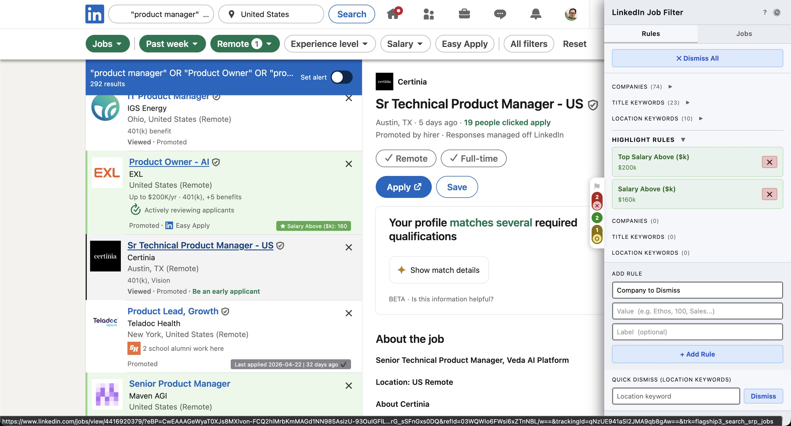

The panel has two tabs: **Rules** (filter and highlight configuration) and **Jobs** (your application log). Cards are scanned automatically as they appear — each one gets a colored border and one or more badges describing why it was flagged. The panel can be minimized to a slim tab strip while you browse.

---

## Flag rules

Flag rules highlight matching cards in red and, optionally, auto-click LinkedIn's native dismiss button to remove them from your feed. Rules target company name, job title, location, or salary range.

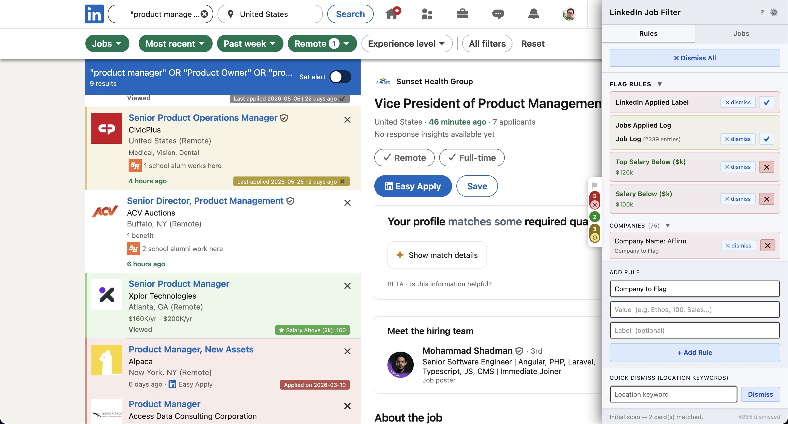

The flag rules section groups all active rules by type. Built-in sticky rules handle cards LinkedIn has already marked **Applied** and any job in your application log. Salary rules let you set a floor on the top-end or base salary listed in a posting.

### Rule types

All available rule types are accessible from the **Add Rule** dropdown:

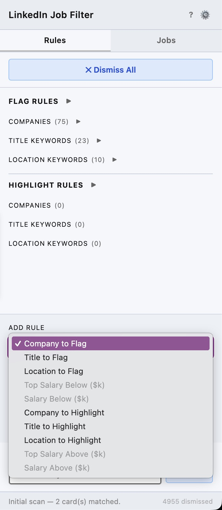

| Type | What it matches |
|---|---|
| Company to Flag | Company name (substring) |
| Title to Flag | Job title text (substring) |
| Location to Flag | Location string (substring) |
| Top Salary Below ($k) | Cards whose listed max salary is below your threshold |
| Salary Below ($k) | Cards whose listed base/min salary is below your threshold |
| Company to Highlight | Company name — highlights green instead of red |
| Title to Highlight | Job title text — highlights green |
| Location to Highlight | Location string — highlights green |
| Top Salary Above ($k) | Cards whose listed max salary is at or above your threshold |
| Salary Above ($k) | Cards whose base salary is at or above your threshold |

### Card badges

Each matched card gets a colored border and a badge naming the rule that fired. Multiple rules can badge the same card simultaneously.

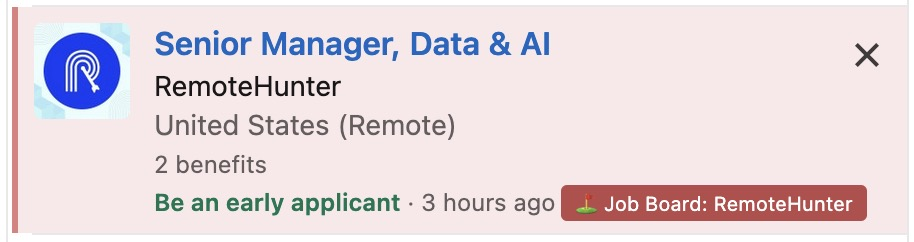

A company flag rule fires on the company name. The badge shows exactly which rule matched — useful when you have dozens of rules and want to know why a card was flagged.

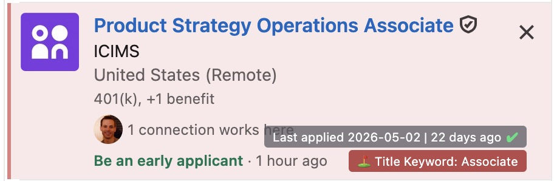

A title keyword rule fires on any match in the job title. This card also has an application log badge — both rules fire independently and stack on the same card.

---

## Highlight rules

Highlight rules work the same way as flag rules but mark cards green. Use them to surface roles from target companies, specific title keywords, or salary thresholds.

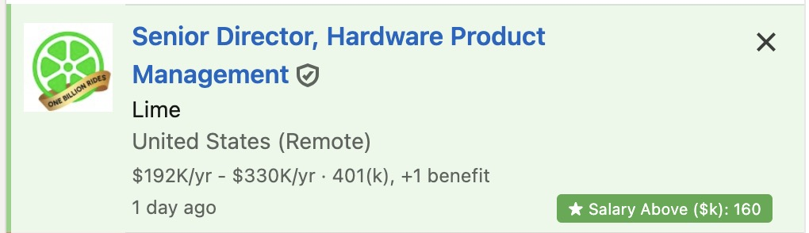

Salary highlight rules badge matching cards with the threshold that matched, so you can tell at a glance which rule surfaced each card.

Highlight rules work on every page that shows job cards — including the **Top picks** section on the LinkedIn homepage:

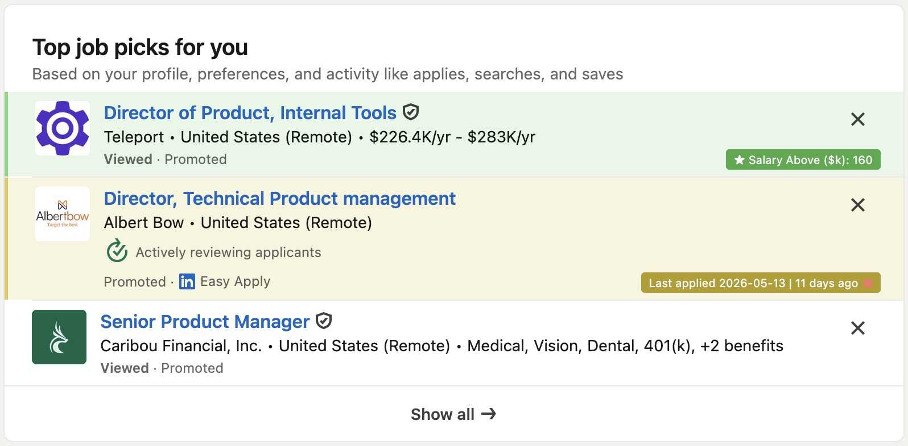

---

## Application log

Auto-captures Easy Apply applications as you submit them, and external applications when you click **Yes** on LinkedIn's "Did you apply?" prompt. Badges cards from companies you've previously applied to with date and days elapsed. You can also import an existing log via CSV or JSON to seed your history.

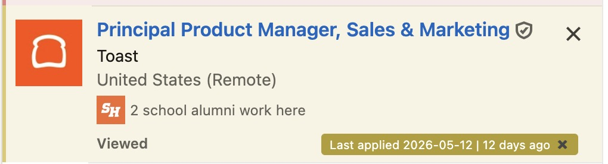

Cards from companies you applied to recently (within your configured reapply window, default 14 days) are highlighted yellow. The **✗** icon means you're still inside the window.

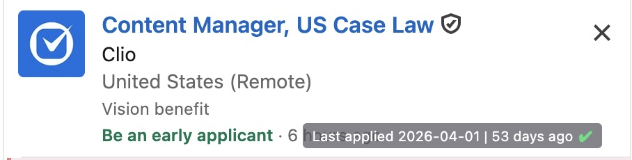

Once you're past the reapply window, the card loses its yellow tint and the badge switches to a green **✓** — safe to apply again.

The **Jobs** tab shows your full log with sortable, filterable columns for company, title, applied date, age, and status:

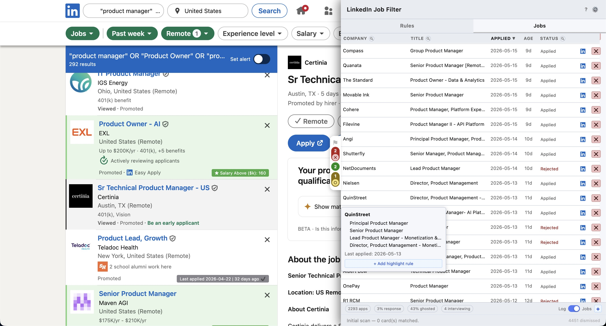

Each column header has a per-column filter. A search bar at the top of the pane lets you search across all columns at once:

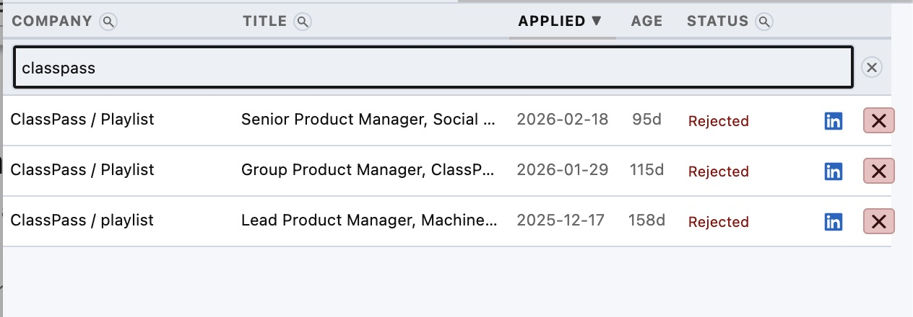

New entries can be added directly from the panel footer — fill in company, title, date, and status, then hit **Save**:

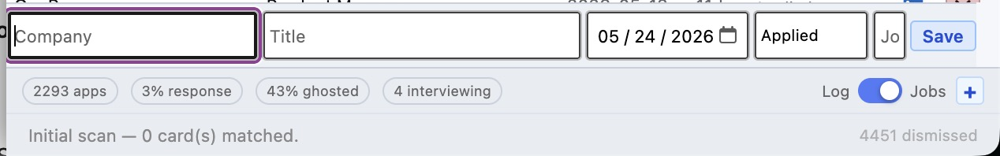

The footer also shows aggregate stats across your entire log: total applications, response rate, ghosted percentage, and active interview count.

---

## Dismiss log

Every time you dismiss a card — via the hover menu, a flag rule, or the quick dismiss button — the company and title are saved to a dismiss log. On future visits, cards matching the log are automatically re-flagged.

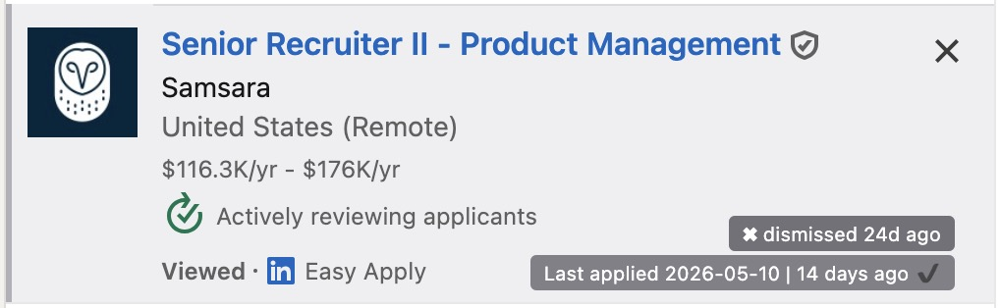

By default re-flagged cards get a grey border and a badge showing how long ago you dismissed them. This keeps previously-dismissed jobs visible without conflating them with active flag-rule matches.

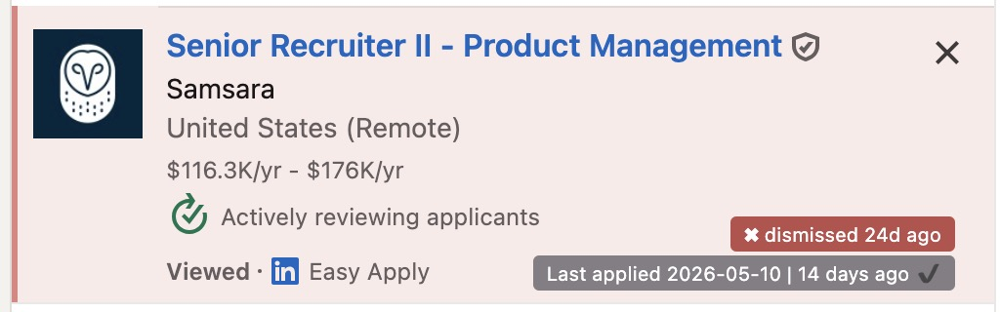

The **Flag dismiss log cards** setting switches the re-flag color from grey to red.

Dismiss log entries expire after a configurable number of days (default: 180). The footer toggle in the Jobs tab switches between the applied log view and the dismiss log view, where you can inspect, edit inline, or delete individual entries. Entries can also be added manually.

---

## Quick hover menu

Hovering a card shows a three-button action menu: **+** adds a highlight rule for this company, **−** adds a flag rule, and **»** jumps to the next matching card.

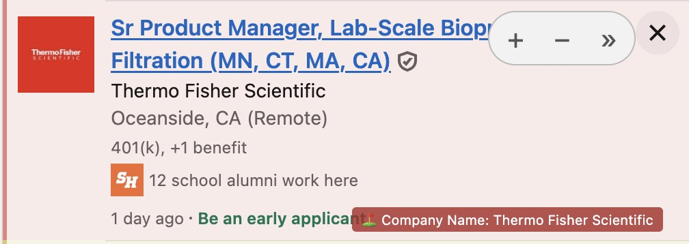

The active **quick dismiss mode** — configurable via the panel footer — determines whether **−** dismisses by company, title, or location. A badge on the card previews exactly what rule will be created before you click.

The vertical tab strip on the right edge summarizes the current page at a glance:

The traffic-light indicators show counts for dismissed (red), recently applied (yellow), and highlighted (green) cards currently visible on the page.

---

## Job detail page

Badges appear on the job detail page too, not just on list cards. If a job matches a highlight rule or you've previously applied to the company, the badge shows in the top-right corner of the posting header.

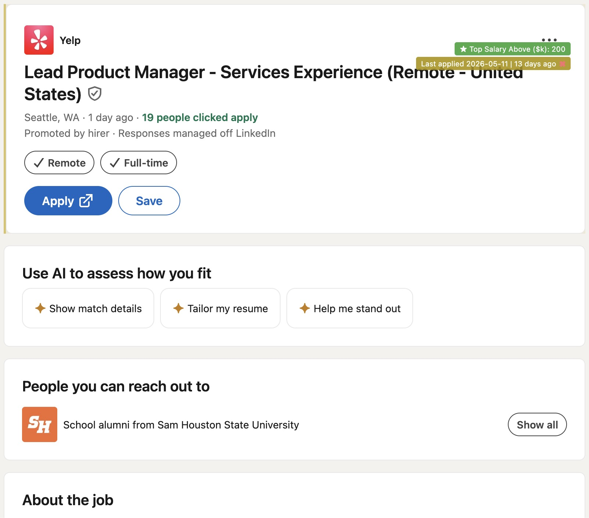

---

## Settings

Open the gear icon in the panel header to access the settings modal.

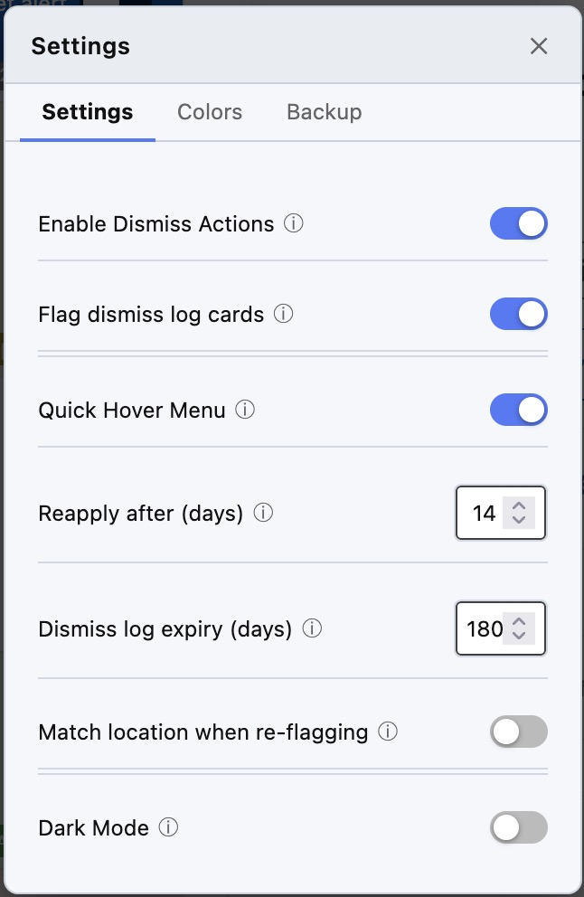

| Setting | Default | Description |
|---|---|---|
| Enable Dismiss Actions | off | Auto-click LinkedIn's dismiss button when a flag rule fires |
| Flag dismiss log cards | off | Show dismiss log re-flags in red instead of grey; also makes them eligible for auto-dismissal when Dismiss Actions is on |
| Quick hover menu | on | Enable the +/−/» hover action buttons |
| Reapply after (days) | 14 | How long before the applied log badge switches from ✗ to ✓ |
| Dismiss log expiry (days) | 180 | How long before dismiss log entries are pruned |
| Match location when re-flagging | off | Add location as a match criterion when re-flagging dismissed cards |
| Dark mode | off | Toggle dark/light theme |

### Custom colors

The **Colors** tab lets you override the default highlight color for each card state. Dark-mode and light-mode variants are configurable independently, with live preview swatches:

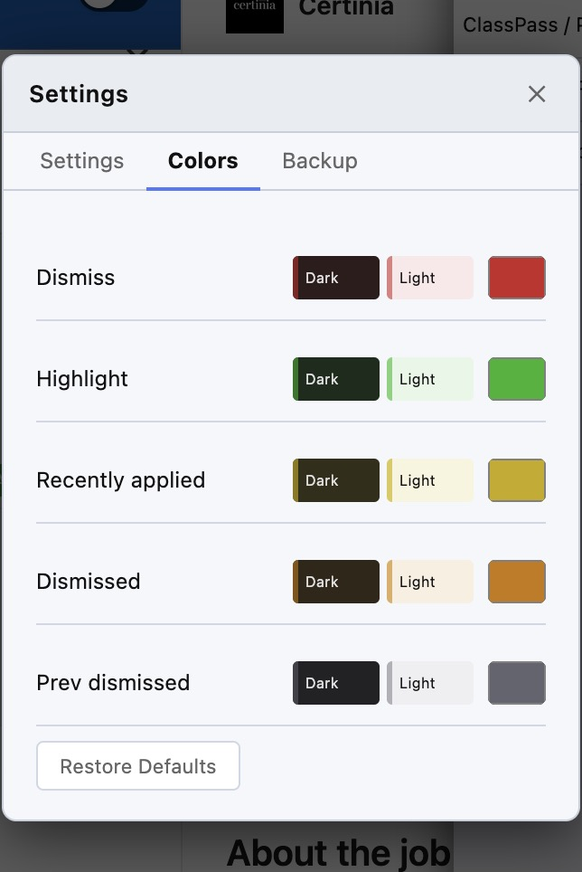

### Backup & restore

The **Backup** tab exports and imports rules and log data as JSON, with a toggle to include the dismiss log in the export. The application log can also be exported as CSV, and a downloadable template is provided if you want to build your log from scratch:

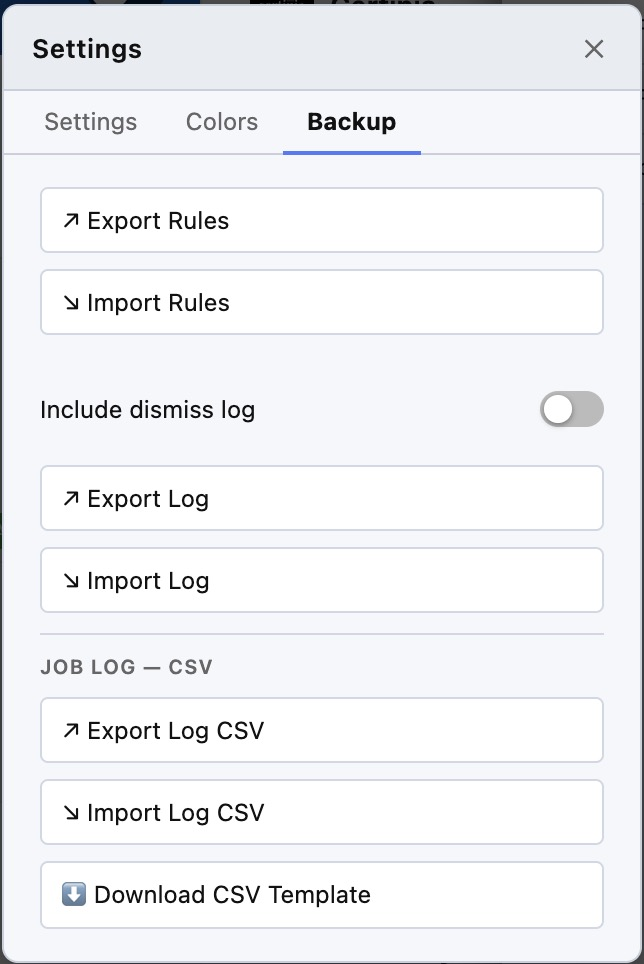

---

## Dismiss actions note

The dismiss feature automates clicks on LinkedIn's native dismiss button. This constitutes automated interaction with their platform and likely violates the LinkedIn User Agreement. It is disabled by default and requires explicit opt-in. Use at your own discretion.

---

## License

GNU General Public License v3.0 — see [LICENSE](LICENSE).
